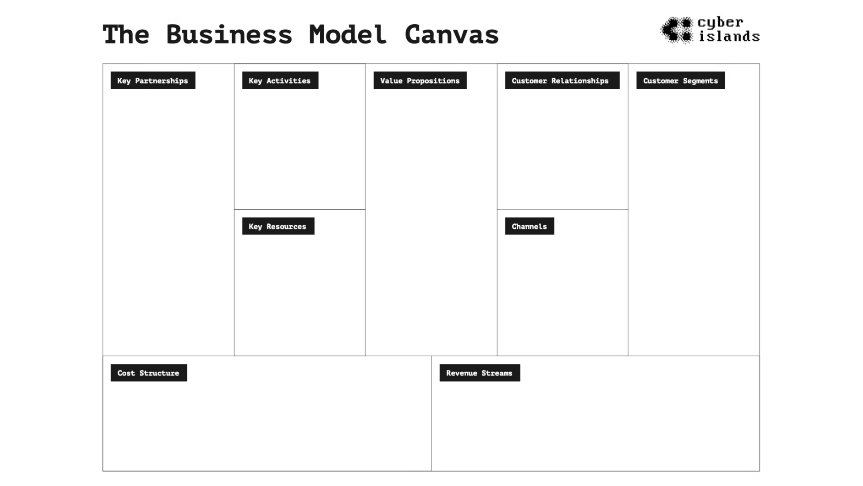

# Day 1
## Initial meeting
Introduction, goal is to support cyber security in 7 different countries with the goal of sharing our knowledge. 

Our task is to propose a solution to a problem. 

### Introduction agenda

( It would be nice to have a presentation for a proper pitch (this will also increase your points) )

#### How we will work today 

### Tools we'll use today

### Challenges
There is a sharepoint with all the information for the challanges here should we choose 1 challenge. 

In the folder itself is a onepager with deadline in information

For the jury is a deticated folder

Team leaders

